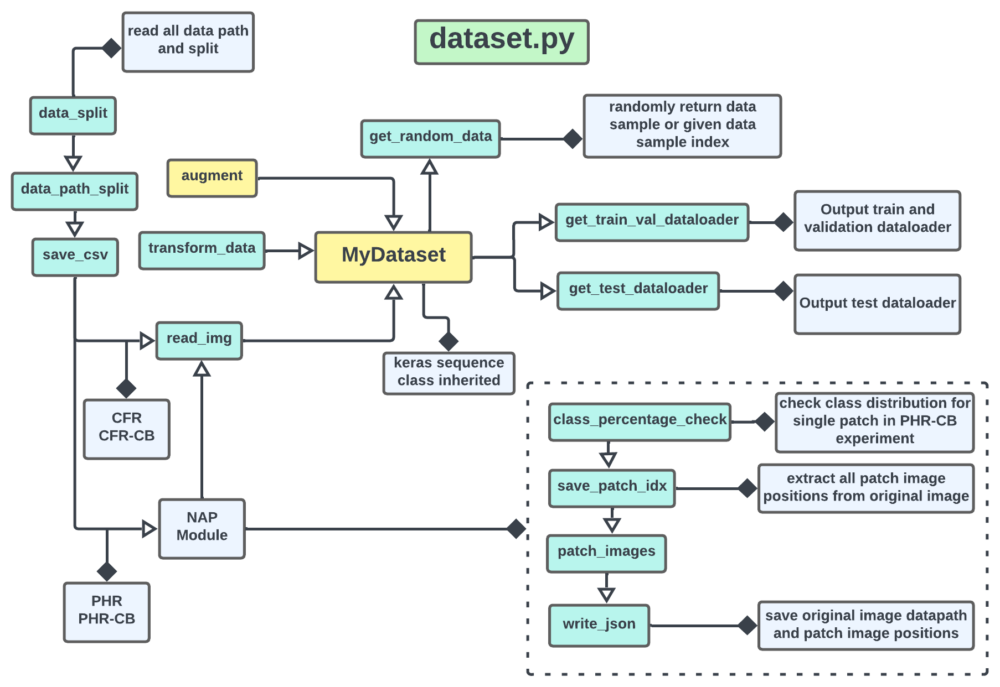

      # Map Floodwater from Radar Imagery


```Tensorflow.keras``` Implementation

## Introduction

The image segmentation model can be used to extract real-world objects from images, blur backgrounds, create self-driving automobiles and perform other image processing tasks. The goal of this research is to create a mask that shows floodwater in a given location based on Sentinal-1 (dual-polarization synthetic-aperture radar (SAR) system) images or features.

## Dataset

The dataset collected from the competition: [Map Floodwater from Radar Imagery](https://www.drivendata.org/competitions/81/detect-flood-water/page/386/) which is hosted by Microsoft AI for Earth. Can be collected from [here](https://map-floodwater-driven-data-competition.s3.amazonaws.com/floodwater-data/floodwater-data.zip). The dataset consists of Sentinel-1 images and masks, as well as a CSV file with metadata such as city and year. Sentinel-1 images and masks are acquired from various parts of the world between 2016 and 2020. In total the dataset consists of 542 chips (1084 images) and corresponding masks. Based on how radar microwave frequency transmits and receives, a single chip comprises two bands or images. Vertical transmit and receive are represented by the VV images. On the other hand, VH images stand for vertical transmit and horizontal receive. Each picture is saved as a GeoTIFF file with the dimension of 512 X 512. The mask consist of three categories:

* Water: 1
* NON-Water: 0
* unlabeled: 255

Some examples from dataset.


## Models

In this repository we implement UNET, U2NET, UNET++, VNET, DNCNN, and MOD-UNET using `Keras-TensorFLow` framework. We also add `keras_unet_collection`(`kuc`) and `segmentation-models`(`sm`) library models which is also implemented using `Keras-TensorFLow`. The following models are available in this repository.

| Model | Name | Reference |
|:---------------|:----------------|:----------------|
| `dncnn`     | DN=CNN         | [Zhang et al. (2017)](https://ieeexplore.ieee.org/document/7839189) |
| `unet`      | U-net           | [Ronneberger et al. (2015)](https://link.springer.com/chapter/10.1007/978-3-319-24574-4_28) |
| `vnet`      | V-net (modified for 2-d inputs) | [Milletari et al. (2016)](https://arxiv.org/abs/1606.04797) |
| `unet++` | U-net++         | [Zhou et al. (2018)](https://link.springer.com/chapter/10.1007/978-3-030-00889-5_1) |
| `u2net`     | U^2-Net         | [Qin et al. (2020)](https://arxiv.org/abs/2005.09007) |
| `mod_unet`     | MU-net         | [In proceeding](#) |
|  | [**keras_unet_collection**](https://github.com/yingkaisha/keras-unet-collection) |  |
| `kuc_r2unet`   | R2U-Net         | [Alom et al. (2018)](https://arxiv.org/abs/1802.06955) |
| `kuc_attunet`  | Attention U-net | [Oktay et al. (2018)](https://arxiv.org/abs/1804.03999) |
| `kuc_restunet` | ResUnet-a       | [Diakogiannis et al. (2020)](https://doi.org/10.1016/j.isprsjprs.2020.01.013) |
| `kuc_unet3pp` | UNET 3+        | [Huang et al. (2020)](https://arxiv.org/abs/2004.08790) |
| `kuc_tensnet` | Trans-UNET       | [Chen et al. (2021)](https://arxiv.org/abs/2102.04306) |
| `kuc_swinnet` | Swin-UNET       | [Hu et al. (2021)](https://arxiv.org/abs/2105.05537) |
| `kuc_vnet`      | V-net (modified for 2-d inputs) | [Milletari et al. (2016)](https://arxiv.org/abs/1606.04797) |
| `kuc_unetpp` | U-net++         | [Zhou et al. (2018)](https://link.springer.com/chapter/10.1007/978-3-030-00889-5_1) |
| `kuc_u2net`     | U^2-Net         | [Qin et al. (2020)](https://arxiv.org/abs/2005.09007) |
|  | [**segmentation-models**](https://github.com/yingkaisha/keras-unet-collection) |  |
| `sm_unet`      | U-net           | [Ronneberger et al. (2015)](https://link.springer.com/chapter/10.1007/978-3-319-24574-4_28) |
| `sm_linknet`     | LINK-Net         | [Chaurasia et al. (2017)](https://arxiv.org/pdf/1707.03718.pdf) |
| `sm_fpn`     | FPS-Net         | [Xiao et al. (2021)](https://arxiv.org/pdf/2103.00738.pdf) |
| `sm_fpn`     | PSP-Net         | [Zhao et al. (2017)](https://arxiv.org/pdf/1612.01105.pdf) |

## Setup

First clone the github repo in your local or server machine by following:
```
git clone https://github.com/samiulengineer/flood_water_mapping_segmentation.git
```

Create a new environment and install dependency from `requirement.txt` file. Before start training check the variable inside config.yaml i.e. `height`, `in_channels`. Keep the above mention dataset in the data folder that give you following structure:

```
--data
    --train_features
        --image_id_vv.tif
        --image_id_vh.tif
            ..
    --train_labels
        --image_id.tif
        --image_id.tif
            ..
    flood-training-metadata.csv
```

## Experiments

After setup the required folders and package run one of the following experiment. There are four experiments based on combination of parameters passing through `argparse` and `config.yaml`. Combination of each experiments given below.

* **Regular**: This experiment utilize the dataset as it is.

```
python train.py --root_dir YOUR_ROOT_DIR \
    --dataset_dir YOUR_ROOT_DIR/data/ \
    --model_name unet \
    --epochs 10 \
    --batch_size 3 \
    --index -1 \
    --experiment regular \
    --patchify False \
    --patch_size 512 \
    --weights False \
```

* **Class Balance**: We balance the dataset biasness towards non-water class in this experiment. 

```
python train.py --root_dir YOUR_ROOT_DIR \
    --dataset_dir YOUR_ROOT_DIR/data/ \
    --model_name unet \
    --epochs 10 \
    --batch_size 3 \
    --index -1 \
    --experiment cls_balance \
    --patchify False \
    --patch_size 512 \
    --weights True \
```

* **Patchify**: In this experiment we take a threshold value (19%) of water class and remove the patch images for each chip that are less than threshold value.

```
python train.py --root_dir YOUR_ROOT_DIR \
    --dataset_dir YOUR_ROOT_DIR/data/ \
    --model_name unet \
    --epochs 10 \
    --batch_size 3 \
    --index -1 \
    --experiment patchify \
    --patchify True \
    --patch_size 256 \
    --weights False \
    --patch_class_balance True
```

* **Patchify Without class Balance**: In this experiment we take all the patch images for each chip.

```
python train.py --root_dir YOUR_ROOT_DIR \
    --dataset_dir YOUR_ROOT_DIR/data/ \
    --model_name unet \
    --epochs 10 \
    --batch_size 3 \
    --index -1 \
    --experiment patchify_WOC \
    --patchify True \
    --patch_size 256 \
    --weights False \
```

## Testing

Run following model for evaluating train model on test dataset.
```
python train.py --gpu "0" \
    --dataset_dir YOUR_ROOT_DIR/data/ \
    --model_name unet \
    --load_model_name my_model.hdf5 \
    --plot_single False \
    --index -1 \
    --patchify False \
    --patch_size 512 \
    --experiment regular \
```

## Result

We train models for all different experiments mention above. Some best and worst prediction result shown below.
Best             |
:-------------------------:

Worst           |


## Overview of the .py files

The following figures are the overview of the important .py files in this repo.





